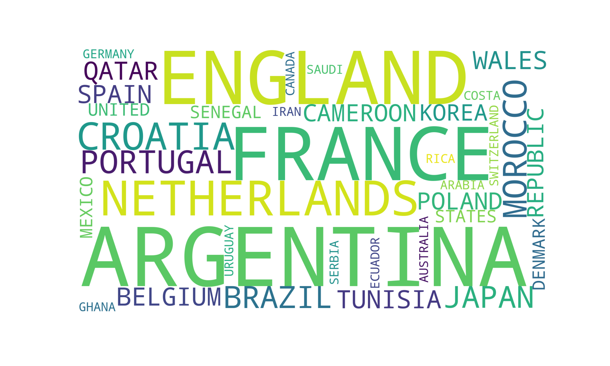

# Fifa WC 2022 Qatar Data Analysis EDA
This ipython notebook is the <b>Exploratory data analysis (EDA)</b> of the <b>FIFA WC Qatar 2022</b>. 
The dataset used has been compiled from various sources by web scrapping. 
You can follow the analysis on <a href="https://www.kaggle.com/code/shrikrishnaparab/fifa-wc-2022-qatar-data-analysis-eda">kaggle</a>

## Packeges Used:
 ![Python][python] ![NumPy][numpy-image] ![Pandas][Pandas-image] ![Matplotlib][Matplotlib-image] ![Plotly][Plotly-image]  ![Jupyter Notebook][ipython-image]
 
[python]: https://img.shields.io/badge/python-3670A0?style=for-the-badge&logo=python&logoColor=ffdd54
[numpy-image]: https://img.shields.io/badge/numpy-%23013243.svg?style=for-the-badge&logo=numpy&logoColor=white
[Pandas-image]: https://img.shields.io/badge/pandas-%23150458.svg?style=for-the-badge&logo=pandas&logoColor=white
[Matplotlib-image]: https://img.shields.io/badge/Matplotlib-%23ffffff.svg?style=for-the-badge&logo=Matplotlib&logoColor=black
[Plotly-image]: https://img.shields.io/badge/Plotly-%233F4F75.svg?style=for-the-badge&logo=plotly&logoColor=white
[ipython-image]: https://img.shields.io/badge/jupyter-%23FA0F00.svg?style=for-the-badge&logo=jupyter&logoColor=white

# What is Exploratory Data Analysis?
Exploratory Data Analysis (EDA) is a technique used to gain insights and understanding from a given dataset. It is an approach for analyzing and summarizing data that allows analysts to identify patterns, trends, and relationships within the data. EDA is typically the first step in the data analysis process and also is an iterative process that involves visualizing and summarizing the data in various ways.

The main goal of EDA is to develop a deeper understanding of the data and identify any potential issue or limitation. This process allows analysts to clean and prepare the data for further analysis, and can also reveal insights that can guide the analysis to move in a proper direction.

One of the key tools used in EDA is visualization. Visualizing data in various ways can reveal patterns and relationships that may not be immediately apparent when looking at raw data.  
Common visualizations used in EDA include:
  1. Histograms
  2. Scatter plots
  3. Box Plots
  4. Bar Charts
  5. Line Charts
  6. Pie Chart or Donut Chart
  7. Bubble Charts  
These visualizations can be used to identify outliers, patterns, and trends in the data, and can also be used to compare different subsets of the data.

Another important aspect of EDA is summarizing the data using statistical measures such as mean, median, standard deviation nd plotting the Corelation Matrix. These measures can be used to understand the distribution of the data and identify any potential outliers.

EDA can also include data cleaning and preprocessing, which is the process of identifying and correcting errors or inconsistencies in the data. This can include handling missing data, removing outliers, or transforming variables to make the data more suitable for analysis.

Overall, EDA is a crucial step in the data analysis process, as it allows analysts to gain a deeper understanding of the data and identify any potential issues or limitations before proceeding with more advanced analysis. It also can also be a great way to find the insights that can guide the further analysis.

## FIFA World Cup 
The FIFA World Cup is an international soccer tournament contested by the men's national teams of the members of Fédération Internationale de Football Association (FIFA), the sport's global governing body. The tournament has been held every four years since 1930, except in 1942 and 1946, due to World War II.

## 2022 FIFA World Cup 
The 2022 FIFA World Cup is scheduled to be the 22nd edition of the FIFA World Cup, the quadrennial international men's football championship contested by the national teams of the member associations of FIFA. It is scheduled to take place in Qatar from 21 November to 18 December 2022. This will be the first World Cup ever to be held in the Middle East and the first in November and December instead of the traditional June and July. The tournament is planned to be played in 8 venues across 5 host cities in the country.

This edition of the World Cup will feature 32 teams, an increase of 16 teams compared to the previous editions. Also this tournament going to be the first to play in the 48 team format ,which was confirmed in 2017 by FIFA council.

## The Task:
The task was to analyze the Fifa WC 2022 data and answer some key questionas like, top goal scorer, team with max possesion, team with max pass accuracy, highest goal scorer team in WC and so on. 
 
## About Data:
The technique used for data collection is web scrapping and data is compiled in a CSV file. The CSV file consist of 59 Columns and has data of all 64 matches played in the world cup 2022. 
The columns can be divided into:
### Basic Match details: 
  - match_no	
  - day_of_week	
  - date	
  - hour	
  - venue	
  - referee	
  - group	
  - 1	(Team 1)
  - 2	(Team 2)
  - attendance
### Other Details: (which are used in the EDA)
  - 1_xg	
  - 2_xg	
  - 1_poss	(Team 1 Possesion) 
  - 2_poss	(Team 2 Possesion) 
  - 1_goals	(Team 1 Goal Scored) 
  - 2_goals	(Team 2 Goal Scored) 
  - score (Fianl Scored of the match)
  - 1_yellow_cards	(Team 1 Yellow Cards)
  - 2_yellow_cards	(Team 2 Yellow Cards)
  - 1_red_cards	(Team 1 Red Cards)
  - 2_red_cards	(Team 2 Red Cards)
  - 1_passes	(Team 1 Passes)
  - 2_passes	(Team 2 Passes)
  - 1_passes_compeletd	(Team 1 Passes completed)
  - 2_passes_compeletd  (Team 2 Passes completed)
  - 1_own_goal	(Own Goal by Team 1)
  - 2_own_goal	(Own Goal by Team 2)

For Analysis purpose we have done feature engineering on the above csv file to create new columns(Features):
1. Total Match Goals ( we have added 1_goals and 2_goals)
2. Pass Acuracy ( (1_passes / 1_passes_compeletd)*100)

The Dataset(CSV) does not have any null data and has no duplicate entry. 

## EDA (Data Analysis Results):
Please Go thorugh the ipython file for more in detail analysis, below are some key Details. 

### Finalist:
    ARGENTINA and FRANCE

### WC Winner:
    ARGENTINA
    
### Teams:

### Total Teams Played: 32
### Teams: 
     ARGENTINA, CROATIA, NETHERLANDS, ENGLAND, FRANCE, JAPAN, BRAZIL, PORTUGAL, MOROCCO, TUNISIA, SPAIN, QATAR, POLAND, KOREA REPUBLIC, WALES, BELGIUM, CAMEROON, GHANA, URUGUAY, UNITED STATES, SWITZERLAND, SERBIA, SENEGAL, IRAN, CANADA, COSTA RICA, DENMARK, ECUADOR, GERMANY, MEXICO, AUSTRALIA, SAUDI ARABIA
### Total Venues:8
### Venues: 
     Lusail Iconic Stadium, Al Bayt Stadium, Khalifa International Stadium, Education City Stadium, Al Thumama Stadium, Ahmed bin Ali Stadium, Stadium 974, Al Janoub Stadium
### Venues according to the matches played:
     Lusail Iconic Stadium            10
     Al Bayt Stadium                   9
     Khalifa International Stadium     8
     Al Thumama Stadium                8
     Education City Stadium            8
     Ahmed bin Ali Stadium             7
     Stadium 974                       7
     Al Janoub Stadium                 7
     
### Venues according to the attendance:
     Lusail Iconic Stadium            874607
     Al Bayt Stadium                  601149
     Khalifa International Stadium    355552
     Education City Stadium           349114
     Al Thumama Stadium               337685
     Ahmed bin Ali Stadium            299517
     Stadium 974                      297854
     Al Janoub Stadium                288774

### Highest Goal Scoring Team:
    France: scored 16 Goals

### Team with Highest pass accuracy:
    ARGENTINA

### Team with Highest possession:
    SPAIN: 75.75%

### Team with Max Yellow Cards:
    ARGENTINA: 16 cards
    
### Teams with Red Cards:
    CAMEROON, MOROCCO, WALES: 1 each
    
### Teams with own goals:
    ARGENTINA, MOROCCO: 1 each

### Top 2 Goal Scorer of World Cup 2022:
    Kylian Mbappe 8 Goals
    Lionel Messi 7 Goals

